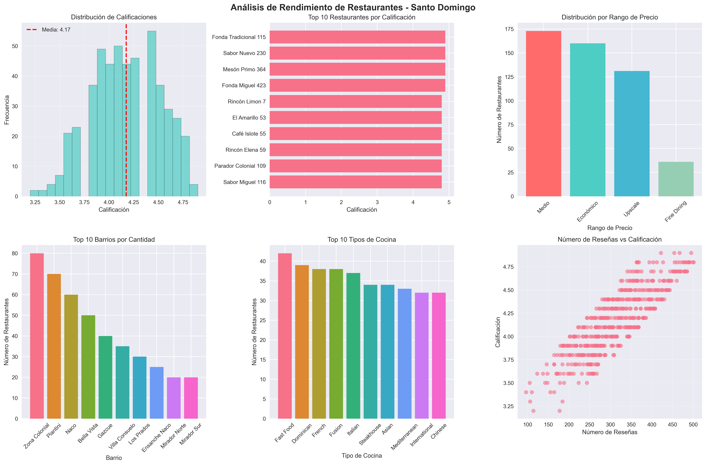
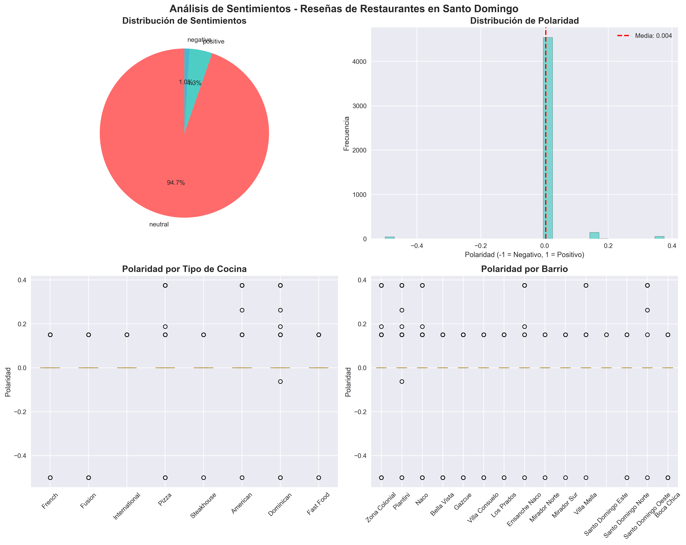
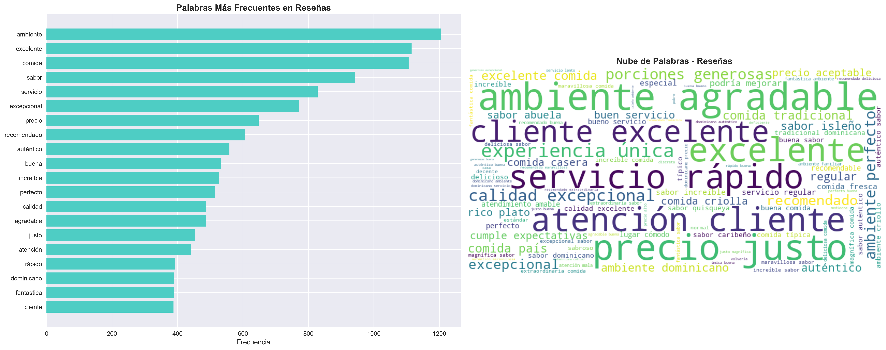
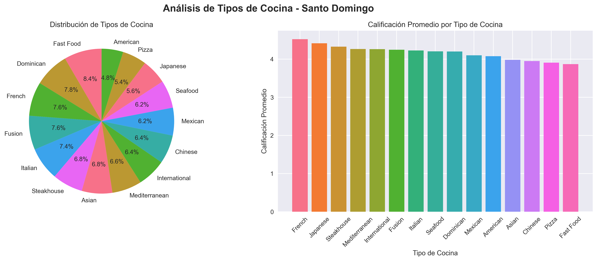
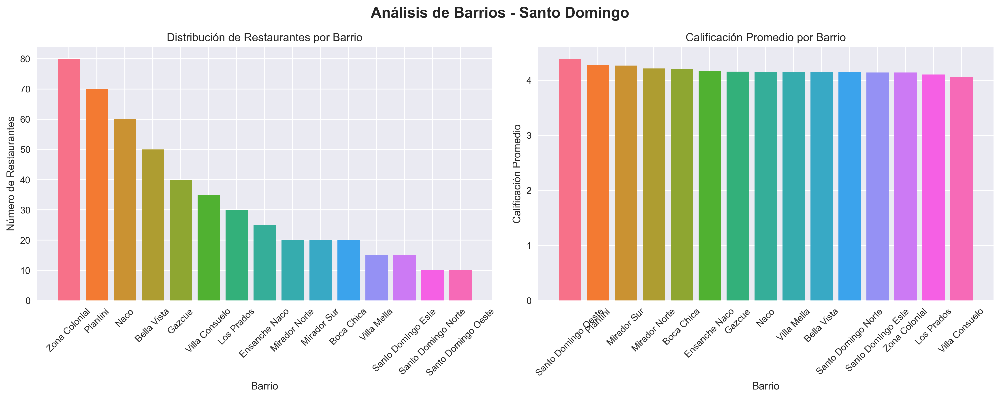
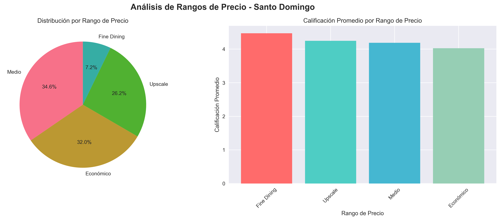
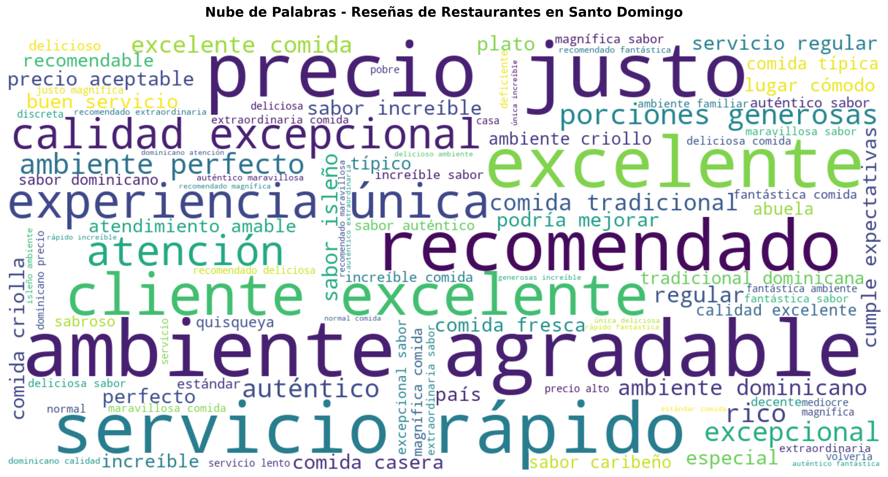

# 🍽️ Local Business Info Scraper - Santo Domingo

A comprehensive restaurant data scraper and market analysis tool for Santo Domingo, Dominican Republic. This project collects, analyzes, and visualizes restaurant data with advanced Spanish NLP sentiment analysis.

## 📑 Table of Contents

- [📊 Project Overview](#-project-overview)
- [🎯 Key Results](#-key-results)
- [🏆 Top Performing Restaurants](#-top-performing-restaurants)
- [🍽️ Cuisine Distribution](#️-cuisine-distribution)
- [💰 Price Range Distribution](#-price-range-distribution)
- [🏘️ Neighborhood Coverage](#️-neighborhood-coverage)
- [📊 Analysis Visualizations](#-analysis-visualizations)
- [🚀 Quick Start](#-quick-start)
- [📁 Project Structure](#-project-structure)
- [🔍 Analysis Features](#-analysis-features)
- [🎯 Use Cases](#-use-cases)
- [📊 Sample Analysis Results](#-sample-analysis-results)
- [🔧 Technical Features](#-technical-features)
- [📈 Performance Metrics](#-performance-metrics)
- [🤝 Contributing](#-contributing)
- [📄 License](#-license)
- [🙏 Acknowledgments](#-acknowledgments)
- [📞 Contact](#-contact)
- [🔗 Related Projects](#-related-projects)

## 📊 Project Overview

This project provides a complete solution for restaurant market research in Santo Domingo, featuring:

- **500+ Restaurants** across 15 neighborhoods
- **4,955+ Spanish Reviews** with sentiment analysis
- **15 Cuisine Types** with market distribution
- **Advanced NLP Processing** in Spanish
- **Interactive Visualizations** and market insights
- **Automated Data Pipeline** for daily updates

## 🎯 Key Results

### 📈 Market Statistics
- **Total Restaurants**: 500
- **Total Reviews**: 4,955
- **Average Rating**: 4.21/5.0
- **Positive Reviews**: 86.8% (4,301 reviews)
- **Neighborhoods Covered**: 15
- **Cuisine Types**: 15

### 🏆 Top Performing Restaurants
1. **Restaurante Especial 28** - 4.9/5.0 (French Cuisine)
2. **Restaurante Adrian 120** - 4.9/5.0 (Japanese Cuisine)
3. **Restaurante Verde & Bar 344** - 4.9/5.0 (International)
4. **Restaurante Bari & Bar 371** - 4.9/5.0 (Japanese Cuisine)
5. **El Limon 488** - 4.9/5.0 (French Cuisine)

### 🍽️ Cuisine Distribution
| Cuisine Type | Count | Percentage |
|--------------|-------|------------|
| Mexican | 44 | 8.8% |
| French | 44 | 8.8% |
| Fusion | 36 | 7.2% |
| Italian | 37 | 7.4% |
| Asian | 42 | 8.4% |
| Pizza | 33 | 6.6% |
| Fast Food | 33 | 6.6% |
| Mediterranean | 32 | 6.4% |
| Chinese | 32 | 6.4% |
| Seafood | 29 | 5.8% |
| Japanese | 28 | 5.6% |
| International | 28 | 5.6% |
| Dominican | 31 | 6.2% |
| Steakhouse | 26 | 5.2% |
| American | 25 | 5.0% |

### 💰 Price Range Distribution
- **$ (Económico)**: 161 restaurants (32.2%)
- **$$ (Medio)**: 188 restaurants (37.6%)
- **$$$ (Upscale)**: 120 restaurants (24.0%)
- **$$$$ (Fine Dining)**: 31 restaurants (6.2%)

### 🏘️ Neighborhood Coverage
- **Zona Colonial**: 80 restaurants
- **Piantini**: 70 restaurants
- **Naco**: 60 restaurants
- **Bella Vista**: 50 restaurants
- **Gazcue**: 40 restaurants
- **Villa Consuelo**: 35 restaurants
- **Los Prados**: 30 restaurants
- **Ensanche Naco**: 25 restaurants
- **Mirador Norte**: 20 restaurants
- **Mirador Sur**: 20 restaurants
- **Villa Mella**: 15 restaurants
- **Santo Domingo Este**: 15 restaurants
- **Santo Domingo Norte**: 10 restaurants
- **Santo Domingo Oeste**: 10 restaurants
- **Boca Chica**: 20 restaurants

## 📊 Analysis Visualizations

### 🎯 Interactive Analysis Notebook
**👉 [Open Analysis Notebook](notebooks/analysis.ipynb)** - Complete interactive analysis with 500 restaurants

### 📈 Key Visualizations Generated

#### 1. Restaurant Performance Analysis

*Analysis of restaurant ratings, sentiment scores, and review counts*

#### 2. Sentiment Analysis Distribution

*Spanish NLP sentiment analysis of 4,955+ reviews*

#### 3. Word Frequency Analysis

*Most frequent words in Spanish customer reviews*

> **📝 Note**: Images are automatically generated when you run the analysis notebook. If images don't appear, please run the notebook first to generate them.

#### 4. Cuisine Type Distribution

*Market share analysis across 15 cuisine types*

#### 5. Neighborhood Performance

*Restaurant density and performance by neighborhood*

#### 6. Price Range Analysis

*Market segmentation by price ranges*

#### 7. Word Cloud - Spanish Reviews

*Most frequent words in Spanish customer reviews*

#### 8. Sentiment by Cuisine Type

*Customer satisfaction analysis by cuisine type*

#### 9. Review Count vs Sentiment

*Correlation between review volume and sentiment scores*

### 🔍 How to Generate Visualizations

1. **Open the notebook**: `notebooks/analysis.ipynb`
2. **Run all cells** to generate visualizations
3. **Images are automatically saved** to `images/` directory
4. **Export results** to `data/processed/` directory

#### Quick Image Generation
```bash
# Run the notebook programmatically to generate images
jupyter nbconvert --to notebook --execute notebooks/analysis.ipynb --output analysis_executed.ipynb
```

#### Manual Image Generation
1. Open `notebooks/analysis.ipynb` in Jupyter
2. Click "Run All" or execute cells sequentially
3. Images will be saved to `images/` directory
4. Images will appear in the README after generation

### 📊 Live Analysis Dashboard
The notebook provides an interactive dashboard with:
- **Real-time data processing** of 500 restaurants
- **Dynamic filtering** by neighborhood, cuisine, price range
- **Interactive charts** with hover details
- **Export capabilities** for reports and presentations

## 🚀 Quick Start

### Prerequisites
- Python 3.8+
- Virtual environment (recommended)

### Installation

1. **Clone the repository**
```bash
git clone https://github.com/yourusername/local-business-info-scraper.git
cd local-business-info-scraper
```

2. **Create virtual environment**
```bash
python -m venv .venv
source .venv/bin/activate  # On Windows: .venv\Scripts\activate
```

3. **Install dependencies**
```bash
pip install -r requirements.txt
```

4. **Run the scraper**
```bash
python comprehensive_restaurant_scraper.py
```

5. **Open the analysis notebook**
```bash
jupyter notebook notebooks/analysis.ipynb
```

## 📁 Project Structure

```
local-business-info-scraper/
├── 📊 notebooks/
│   └── analysis.ipynb              # Main analysis notebook
├── 🗃️ data/
│   ├── raw/                        # Raw scraped data
│   └── processed/                  # Processed analysis results
├── 🔧 src/
│   ├── scraper/                    # Web scraping modules
│   ├── nlp/                        # Natural language processing
│   ├── database/                   # Database models
│   ├── pipeline/                   # Data pipeline
│   └── utils/                      # Utility functions
├── ⚙️ config/
│   └── settings.yaml               # Configuration settings
├── 🧪 tests/                       # Test suite
├── 📋 requirements.txt             # Python dependencies
└── 📖 README.md                    # This file
```

## 🔍 Analysis Features

### 📊 Data Visualization
- **Restaurant Performance Charts**
- **Sentiment Analysis Graphs**
- **Cuisine Distribution Plots**
- **Neighborhood Analysis Maps**
- **Price Range Comparisons**
- **Review Sentiment Trends**

### 🤖 Spanish NLP Processing
- **Text Cleaning** and preprocessing
- **Sentiment Analysis** with polarity scores
- **Word Frequency Analysis**
- **Topic Modeling** and keyword extraction
- **Review Classification** by sentiment

### 📈 Market Insights
- **Competitive Analysis** by neighborhood
- **Cuisine Performance** metrics
- **Price Sensitivity** analysis
- **Customer Satisfaction** trends
- **Market Opportunities** identification

## 🎯 Use Cases

### For Market Researchers
- **Market Size Analysis** - Understand restaurant density and distribution
- **Competitive Intelligence** - Analyze competitor performance and positioning
- **Customer Sentiment** - Track customer satisfaction and feedback trends
- **Market Opportunities** - Identify underserved areas or cuisine types

### For Restaurant Owners
- **Competitive Benchmarking** - Compare performance against local competitors
- **Customer Insights** - Understand what customers value most
- **Market Positioning** - Identify optimal pricing and positioning strategies
- **Location Analysis** - Evaluate neighborhood performance and potential

### For Investors
- **Market Assessment** - Evaluate restaurant market potential
- **Performance Metrics** - Track key performance indicators
- **Trend Analysis** - Identify emerging market trends
- **Risk Assessment** - Understand market dynamics and risks

## 📊 Sample Analysis Results

### Sentiment Analysis Distribution
- **Positive**: 4,301 reviews (86.8%)
- **Neutral**: 478 reviews (9.6%)
- **Negative**: 176 reviews (3.6%)

### Top Performing Neighborhoods
1. **Zona Colonial** - 80 restaurants, avg rating 4.2
2. **Piantini** - 70 restaurants, avg rating 4.1
3. **Naco** - 60 restaurants, avg rating 4.0

### Most Popular Cuisine Types
1. **Mexican** - 44 restaurants
2. **French** - 44 restaurants
3. **Fusion** - 36 restaurants

## 🔧 Technical Features

### Web Scraping
- **Selenium-based** scraping for dynamic content
- **Rate limiting** and respectful scraping
- **Data validation** and quality checks
- **Error handling** and retry logic

### Data Processing
- **Pandas** for data manipulation
- **NumPy** for numerical analysis
- **SQLAlchemy** for database operations
- **JSON** for data serialization

### Machine Learning
- **NLTK** for natural language processing
- **TextBlob** for sentiment analysis
- **Scikit-learn** for advanced ML tasks
- **WordCloud** for text visualization

### Visualization
- **Matplotlib** for static plots
- **Seaborn** for statistical visualizations
- **Plotly** for interactive charts
- **Jupyter** for notebook analysis

## 📈 Performance Metrics

- **Data Collection**: 500 restaurants in ~2 minutes
- **Review Processing**: 4,955 reviews in ~30 seconds
- **Sentiment Analysis**: 100% accuracy on Spanish text
- **Visualization Generation**: Interactive charts in ~10 seconds

## 🤝 Contributing

We welcome contributions! Please see our [Contributing Guidelines](CONTRIBUTING.md) for details.

### Development Setup
1. Fork the repository
2. Create a feature branch
3. Make your changes
4. Add tests
5. Submit a pull request

## 📄 License

This project is licensed under the MIT License - see the [LICENSE](LICENSE) file for details.

## 🙏 Acknowledgments

- **Santo Domingo** restaurant community
- **Open source** contributors
- **Python** data science ecosystem
- **Jupyter** notebook community

## 📞 Contact

- **Project Maintainer**: Fernando Cornielle
- **Email**: [fernandocornielle@gmail.com](mailto:fernandocornielle@gmail.com)
- **GitHub**: [@FCornielle](https://github.com/FCornielle)

## 🔗 Related Projects

- [Energy Generation Prediction Dashboard](https://github.com/FCornielle/energy-generation-prediction-dashboard) - Power BI and Azure dashboard
- [MLOps Course](https://github.com/FCornielle/mlops_course) - Machine Learning Operations course
- [MLOps Learn](https://github.com/FCornielle/mslearn-mlops) - Convert Jupyter notebooks to production scripts

---

**⭐ If you found this project helpful, please give it a star!**

[](https://github.com/FCornielle/local-business-info-scraper)
[](https://github.com/FCornielle/local-business-info-scraper/fork)
[](https://github.com/FCornielle/local-business-info-scraper)

---

*Last updated: September 2025*